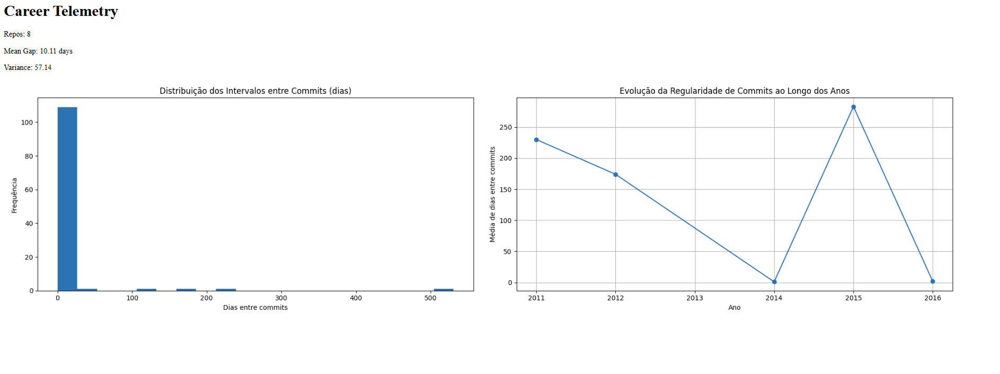

Tá bem perto — só tem **3 problemas** no seu README agora:

1. **Você esqueceu de fechar** o bloco de código do TL;DR (faltou ``` antes do “## 🚀 Installation”).
2. Os **badges estão com URL placeholder** (`usuario` / `your-username`).
3. Em “Usage” você ainda usa `python cli.py ...` — melhor vender `gct ...` (você já tem entrypoint).

Abaixo vai um **README completo**, já corrigido, pronto pra você **substituir inteiro**.

---

# README.md (cole tudo e salve)

````md
# Git Career Telemetry




A tool to analyze **developer behavior and evolution** over time using public GitHub data. Instead of counting commits, it measures **regularity, consistency, and progression** via time-based metrics.

## ⚡ TL;DR
- **Analyze** consistency (mean gap, variance) for any user or organization.
- **Visualize** habits with timeline charts and histograms.
- **Cache-optimized** to respect GitHub API rate limits.

```bash
# Analyze a user
gct user torvalds --format md

# Analyze an organization
gct org facebook --top 10
````

## 🚀 Installation

### Option 1: Development Mode (Recommended)

```bash
git clone https://github.com/jl-07/github-getsummary.git
cd github-getsummary

python -m venv venv
# Windows:
.\venv\Scripts\Activate.ps1
# Linux/Mac:
# source venv/bin/activate

pip install -r requirements.txt
pip install -e .

gct --help
```

### Option 2: Run "As Is"

Ensure you have Python 3.10+ installed.

```bash
pip install -r requirements.txt
python cli.py --help
```

## 📖 Usage

### User Analysis

Checks consistency of a specific user across all their public repositories.

```bash
gct user <username> --ttl 12 --format md --output report.md
```

### Organization Analysis

Checks consistency for repositories belonging to an organization.

```bash
gct org <orgname> --top 20 --format html --output report.html
```

### Examples

See [examples/reports/](examples/reports/) for sample outputs.

## 🏗️ Architecture

* **`core/`**: Business logic.

  * `github_client.py`: Handles API requests and caching (ETag/304 + TTL).
  * `metrics/`: Statistical calculations (Consistency, Timeline).
  * `use_cases.py`: Orchestrates fetching, calculation, and reporting.
* **`visualization/`**: Plotting logic using Matplotlib.
* **`cli.py`**: CLI entry point using Typer (`gct`).

### Caching & Rate Limits

To avoid hitting GitHub's API rate limit (60 requests/hour unauthenticated):

* **Disk Cache**: Responses stored in `.cache/` (hashed by URL + params).
* **Conditional Requests**: Uses `ETag` and `Last-Modified`.

  * If API returns **304 Not Modified**, cached response is reused.
* **TTL**: Configurable (default 12h). Fresh cache hits don’t touch the network.

## 🔐 Security

* **Token Optional**: You can run without a token (lower rate limit).
* **Environment Variable**: To increase limits (5000 req/hour), set `GITHUB_TOKEN`.
* **No Sensitive Data**: Only reads public repository metadata.

> Tip (PowerShell):
>
> ```powershell
> $env:GITHUB_TOKEN="YOUR_TOKEN"
> gct user octocat --format html --output report.html
> ```

## 🗺️ Roadmap

* [ ] Add support for GitLab/Bitbucket.
* [ ] Comparison mode (compare year X vs year Y).
* [ ] Export to PDF.
* [ ] Web UI (Streamlit/FastAPI).
* [ ] Activity Heatmap (like GitHub's profile graph).

## 🤝 Contributing

1. Open an Issue to discuss the change.
2. Fork the repository.
3. Create a branch (`feature/amazing-feature`).
4. Commit changes.
5. Open a Pull Request.

Ensure `pytest` and `ruff check .` pass before submitting.

## 📄 License

Distributed under the MIT License. See [LICENSE](LICENSE) for more information.

````

---
