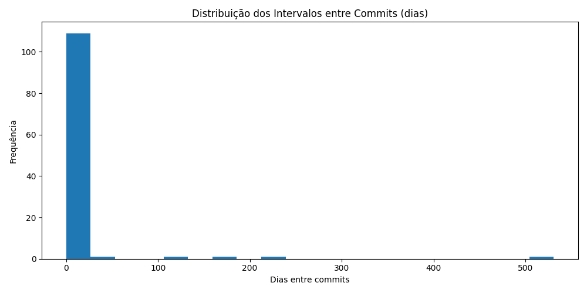
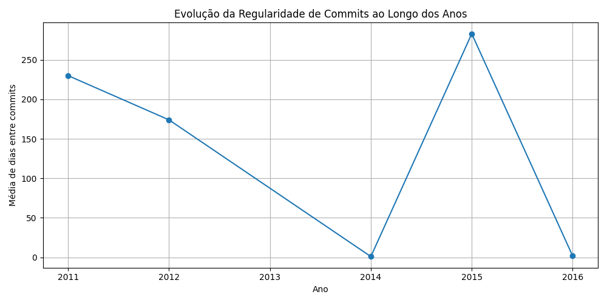

# Git Career Telemetry

Este projeto analisa **o comportamento e a evolução de um desenvolvedor** ao longo do tempo, utilizando **dados públicos do GitHub**. Ao invés de focar apenas na **quantidade de commits**, o objetivo aqui é medir **regularidade, consistência e evolução**.

Através de métricas de tempo, o projeto mapeia a frequência de commits e sua evolução ao longo dos anos, permitindo uma análise mais profunda sobre a disciplina e a progressão de um desenvolvedor.

---

## ❌ O que este projeto NÃO faz:
- Não cria pontuação de “nível” de desenvolvedor.
- Não realiza comparações de desenvolvedores entre si.
- Não usa gamificação.
- Não coleta dados privados do GitHub.

## 📊 Métrica de Consistência

- **Média de dias entre commits:** 10.11
- **Variância dos intervalos:** 57.14

> Quanto menor a variância, mais consistente é a atividade ao longo do tempo.

---

## 📈 Distribuição dos intervalos entre commits

---

## 🧭 Linha do tempo de consistência

---

## 🛠️ Stack

- Python
- GitHub REST API
- Matplotlib
- Análise temporal de dados

---

## 📌 Objetivo do projeto

Demonstrar evolução técnica real ao longo do tempo, indo além de contagem de commits.

Este projeto não mede "quantidade de commits".
Ele analisa padrões de consistência, pausas e evolução ao longo do tempo,
que são sinais indiretos de maturidade profissional.

## ❌ O que este projeto NÃO faz (de propósito)

- **Não cria pontuação gamificada**: O objetivo não é gerar um ranking entre desenvolvedores, mas sim analisar o comportamento de um único desenvolvedor.
- **Não compara pessoas**: O foco está no próprio desenvolvimento de um único usuário.
- **Não usa IA ou machine learning**: Focamos apenas em métricas e dados reais.
- **Não coleta dados privados**: Só utilizamos dados públicos disponíveis nas APIs do GitHub.